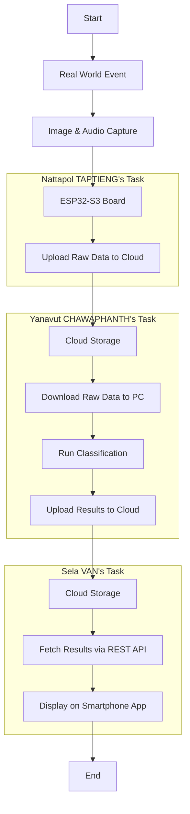
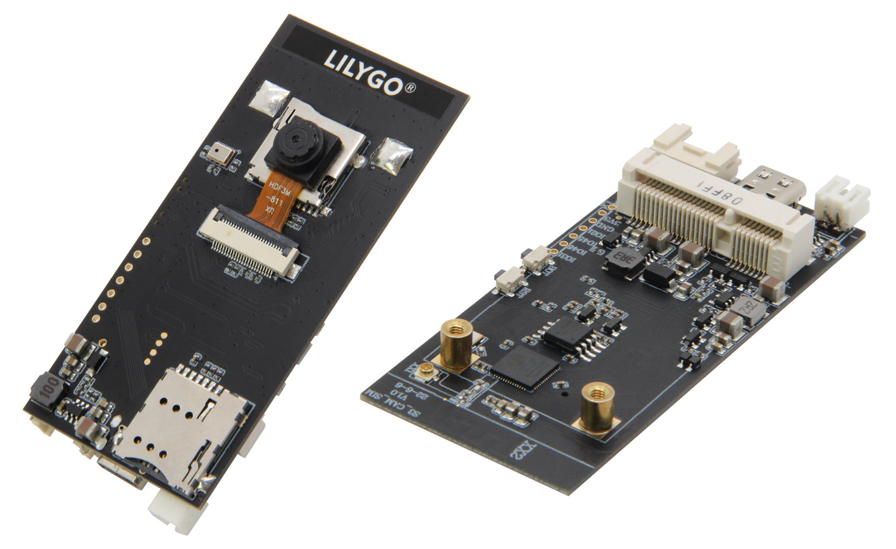
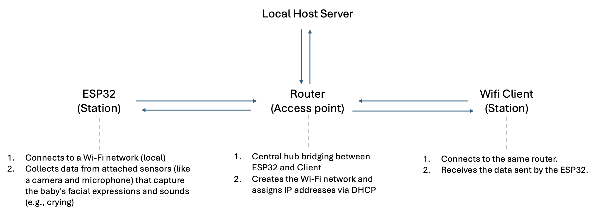
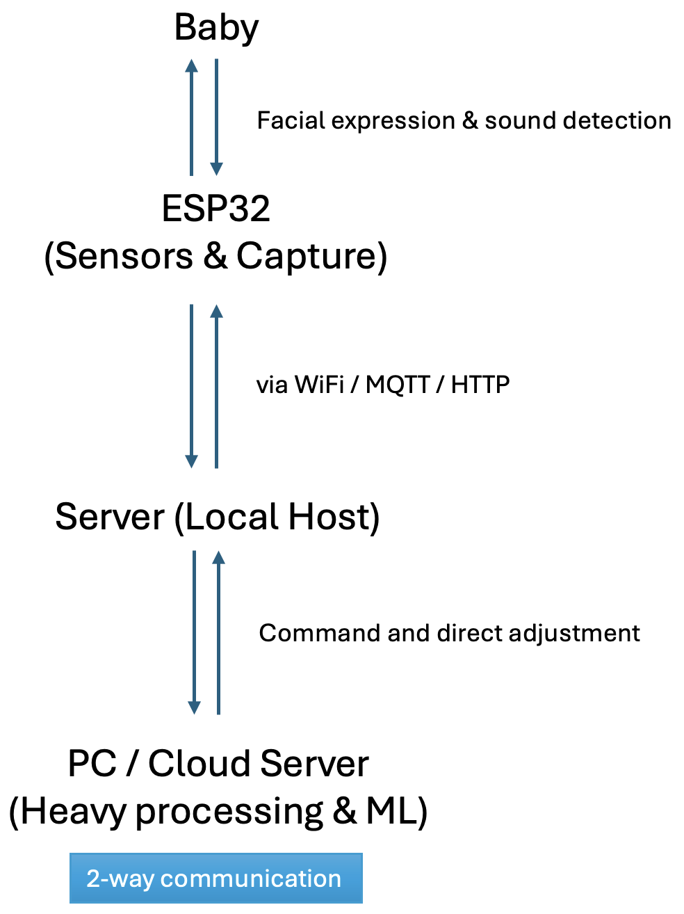

# ict720_software_2025_baby_observation

<div style="text-align: center;">
  
</div>

## Member:
1. Nattapol TAPTIENG (zaku.capzicumz@gmail.com) --> _[Project_Manager]_
2. Sela VAN --> _[Web_Development]_
3. Yanavut CHAWAPHANTH --> _[Image_Object_Detection]_

## PIC_Flow:





## Domain: Baby Observation (There...There...🥰)


## User Story:
As a parent, I want a smart and attentive companion that continuously watches over my baby. Whenever my baby wakes, cries, or behaves unusually, I need to be instantly alerted, no matter where I am in the house or outside. This way, I can quickly comfort and ensure my baby's safety, giving me peace of mind and confidence to handle daily tasks without worry.


## 1. **Introduction**
Have you ever wanted to spend the night without your adorable, lovely, fragile baby? (Let's have some space between us!) 😗


## 2. **Objective**
- Ensure the status of the baby while parents are in the different rooms or during the nighttime.
- To detect facial expression analysis of the baby _(identifying crying or distressed facial cues)_
- To detect sound detection of the baby _(microphone data to detect crying sounds)_


## 3. **Hardware**

The T-SIMCAM ESP32-S3 CAM is a versatile development board designed by LilyGO, featuring the ESP32-S3 microcontroller. It integrates a camera, wireless connectivity, and expansion options, making it suitable for IoT, computer vision, and edge computing projects.

<!--  -->
<!-- img src="images/ESP32-S3-camera-board.jpg" width="600" -->
<!-- to adjust the width and position "center", "left", or "right" -->
<p align="center">
  
</p>

**T-SIMCAM ESP32-S3 CAM Hardware Specification**

**Microcontroller Unit (MCU)**
- Model: ESP32-S3R8
- Architecture: Dual-core Xtensa LX7 microprocessor
- Clock Speed: Up to 240 MHz
- Memory:
  - RAM: 8 MB PSRAM
  - Flash Storage: 16 MB QSPI flash
- Wireless Connectivity:
  - Wi-Fi: IEEE 802.11b/g/n (2.4 GHz)
  - Bluetooth: Version 5.0 LE and Mesh

**Camera**
- Sensor: OV2640
- Resolution: 2 Megapixels (1622×1200)
- Frame Rate: Up to 60 fps

**Audio**
- Microphone: I2S digital microphone (MSM261S4030H0R)
- Microphone Module
  - Connects to the ESP32’s ADC1 pins (best result)
  - ADC operates between 0 V and ~3.3 V.


image source: https://lastminuteengineers.com/esp32-pinout-reference/


**Expansion and Connectivity**
- MicroSD Card Slot: Supports external storage
- mPCIe Socket: Optional cellular modules (NB-IoT, 2G GSM, 3G/4G LTE)
- SIM Card Slot: Nano-SIM compatibility (requires additional mPCIe module)
- Grove Connector: For easy sensor integration
- USB Port: 1x USB Type-C for power and programming

**Power Supply**
- USB-C Port: 5V DC input
- Battery Support: 2-pin JST connector for LiPo batteries
- Charging Chip: TP4056, supports up to 580 mA charging current

**Dimensions**
- Size: 82 x 35.5 x 12 mm

## 4. **Software**

## 5. **Network and Connection**
- Station Mode





- ESP32 with external processing unit
- ESP32 (C/C++) → Communication Layer (e.g. MQTT) → ML Processing (Python)

## 6. **Data Approach**
| No. | Data Aspect | Description                                   | Type                        | Format                     | Collecting Medium   | Data Management                           | Process                  |
|-----|-------------|-----------------------------------------------|-----------------------------|----------------------------|---------------------|--------------------------------------------|--------------------------|
| 1   | **Images**  | Photos captured from ESP32-CAM                | Raw Image (RGB/Grayscale)   | .jpg / .png / .bmp         | ESP32-CAM           | Data Cleaning, Data Labeling, Data Logging | Face Detection           |
| 2   | **Audio**   | Sound captured from a microphone (ESP32 ADC)  | PCM / WAV                   | .wav / .pcm                | ESP32 Microphone    |                                            | Expression Classification|
| 3   | **Timestamps** | Time of data collection                    | DateTime                    | ISO 8601 format            | System Clock        |                                            | Cry Detection            |
| 4   | **Metadata** | Device ID, environment conditions            | JSON                        | .json                      | ESP32               |                                            | Alert System             |

### 7W Data Structure

| **7W**   | **Description** | **Value (Example)** | **Data Type** | **Remark** |
|----------|---------------|--------------------|--------------|-----------|
| **Who** | Identifies the observer (parent, caregiver, AI system) | "Parent", "Nanny", "AI Monitor" | String | N/A |
| **When** | Timestamp of the observation | `YY/MM/DD H/M/S` | Datetime | Global UTC time |
| **What** | Baby's current status or action | "Angry", "Disgust", "Fear", "Happy" , "Neutral" , "Surprise" | String | N/A |
| **Why** | Possible reason for the baby's state | "Hungry", "Diaper wet", "Sleepy", "Happy interaction" | String | Optional for further baby status analysis and interpretation. |
| **Which** | Identifies specific signals used to classify the baby's state | "Audio (cry sound detected)", "Video (facial expression detected)" | String | N/A |
| **Where** | Location where the observation was made | "Crib", "Living Room", "Car Seat", "Daycare" | String | N/A |
| **Whose** | Identifies the baby being observed | "Baby A", "Baby B" | String | Consider a family with more than one baby (e.g., siblings). |


The data can be stored in JSON format for further processing:
### Json Representation

```json
[
    {
        "7W": "Who",
        "Description": "Identifies the observer (parent)",
        "Value": ["Parent"],
        "Data_Type": "String",
        "Remark": "N/A"
    },
    {
        "7W": "When",
        "Description": "Timestamp of the observation",
        "Value": "YY/MM/DD H/M/S",
        "Data_Type": "Datetime",
        "Remark": "Global UTC time"
    },
    {
        "7W": "What",
        "Description": "Baby's current status or action",
        "Value": ["Crying", "Sleeping", "Smiling", "Waking Up"],
        "Data_Type": "String",
        "Remark": "N/A"
    },
    {
        "7W": "Why",
        "Description": "Possible reason for the baby's state",
        "Value": ["Hungry", "Diaper wet", "Sleepy", "Happy interaction"],
        "Data_Type": "String",
        "Remark": "Optional for further baby status analysis and interpretation."
    },
    {
        "7W": "Which",
        "Description": "Identifies specific signals used to classify the baby's state",
        "Value": ["Audio (cry sound detected)", "Video (facial expression detected)"],
        "Data_Type": "String",
        "Remark": "N/A"
    },
    {
        "7W": "Where",
        "Description": "Location where the observation was made",
        "Value": ["Crib", "Living Room", "Car Seat", "Daycare"],
        "Data_Type": "String",
        "Remark": "N/A"
    },
    {
        "7W": "Whose",
        "Description": "Identifies the baby being observed",
        "Value": ["Baby A", "Baby B"],
        "Data_Type": "String",
        "Remark": "For example, consider a family with more than one baby. E.g., siblings"
    }
]

## 8. **Reference**
- Buy T-SIMCAM (ESP32-S3) at: https://lilygo.cc/products/t-simcam
- How to use ESP32-S3: https://randomnerdtutorials.com/
