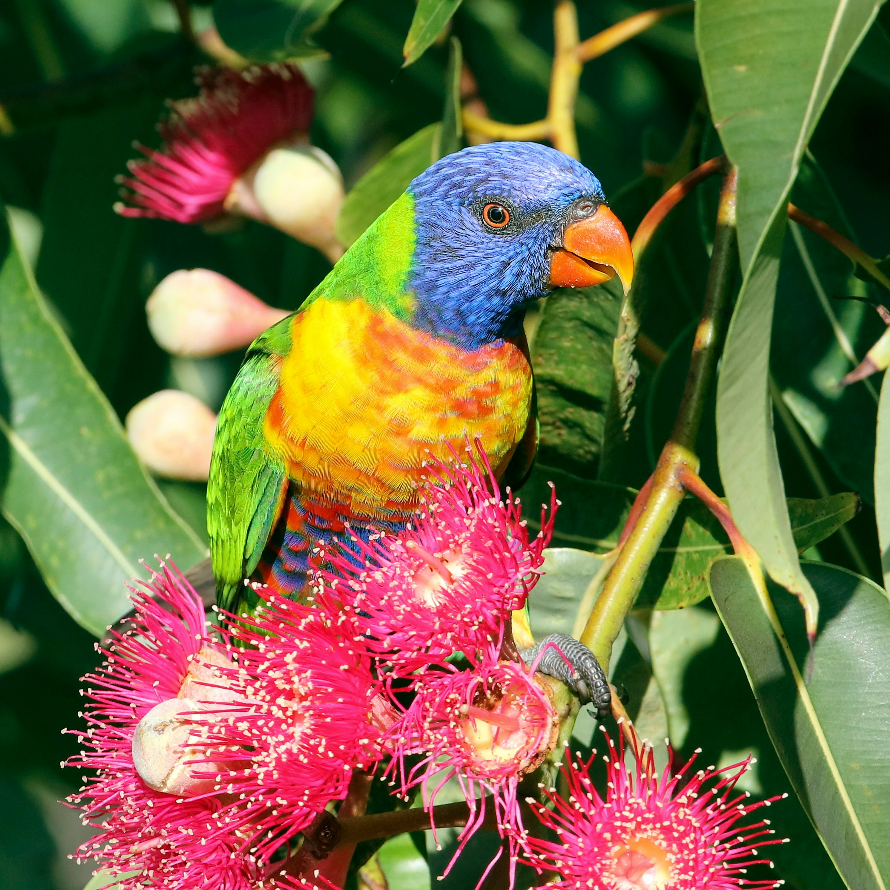

# ict720_software_2025_TBD
Create a user story

## Member:
1. Nattapol TAPTIENG (zaku.capzicumz@gmail.com)
2. Sela VAN
3. Yanavut CHAWAPHANTH

## Domain: Project Title 
1. **Introduction**

Description here

2. **Objective**
- Image recognition
- 

3. **Hardware**
- Hardware name: T-SIMCAM (ESP32-S3 CAM Development Board WiFi Bluetooth 5.0 Wireless Module)
- Sensor:
  - Camera
  - WiFi
  - Microphone
  - Bluetooth

5. **Software**

Description here

6. **Reference**
- Buy T-SIMCAM (ESP32-S3) at: https://lilygo.cc/products/t-simcam
- How to use ESP32-S3: https://randomnerdtutorials.com/

Description here

# hehehehe

