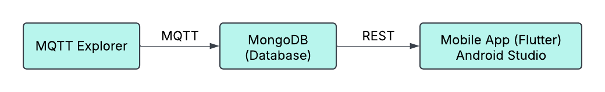

# Mobile App Development System

This baby observation project integrating MQTT, MongoDB, REST API, and a Flutter mobile app for real-time data monitoring/

<div style="text-align: center;">
  
</div>

Demonstration

<div style="text-align: center;">
  
</div>


## 📦 Components

### 1. **MQTT Explorer**
   - Core application to interact with MQTT brokers (subscribe/publish messages).  


### 2. **MQTT Protocol**
   - Lightweight publish-subscribe messaging for real-time device communication.  
   *Broker: Mosquitto.

### 3. **MongoDB**
   - NoSQL database storing MQTT messages, device metadata, and historical data.  
   *Collections: `devices`, `messages`, `users`.*

### 4. **REST API**
   - **Framework**: Flask/Django  
   - **Endpoints**:  
     - `GET /api/messages` – Fetch stored MQTT data.  
     - `POST /api/command` – Send commands to devices.  

### 5. **Mobile App (Flutter)**
   - Cross-platform app to visualize data and control devices.  
   *Features: Real-time charts, topic subscription, alert notifications.*

---

## 🚀 Setup

### Prerequisites
- Python 3.8+ (REST API)
- Flutter SDK (Mobile App)
- MongoDB 5.0+
- MQTT Broker (e.g., Mosquitto)

### Installation
1. **MQTT Broker**  
   ```bash
   sudo apt install mosquitto mosquitto-clients  # Linux
